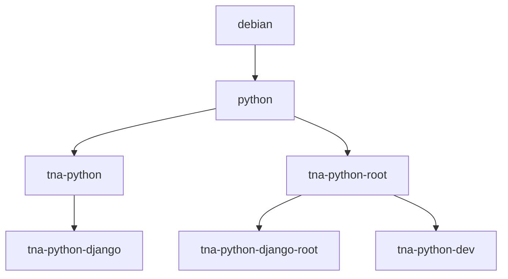

# National Archives Base Docker Images

The National Archives base Docker images are designed to serve as a starting point for all containerised applications in The National Archives.

## Base images

| Image                                           | Dockerfile                                                            | Base image        | User   |
| ----------------------------------------------- | --------------------------------------------------------------------- | ----------------- | ------ |
| [`tna-python`](docker/tna-python)               | [`tna-python/Dockerfile`](docker/tna-python/Dockerfile)               | `python`          | `app`  |
| `tna-python-root`                               | [`tna-python/Dockerfile`](docker/tna-python/Dockerfile)               | `python`          | `root` |
| [`tna-python-django`](docker/tna-python-django) | [`tna-python-django/Dockerfile`](docker/tna-python-django/Dockerfile) | `tna-python`      | `app`  |
| `tna-python-django-root`                        | [`tna-python-django/Dockerfile`](docker/tna-python-django/Dockerfile) | `tna-python-root` | `root` |
| [`tna-python-dev`](docker/tna-python-dev)       | [`tna-python-dev/Dockerfile`](docker/tna-python-dev/Dockerfile)       | `tna-python-root` | `root` |

### Image inheritance

